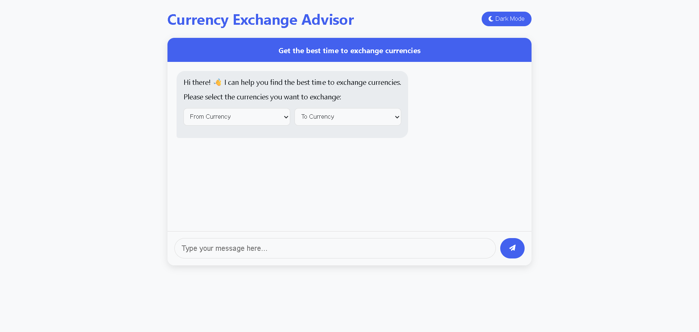
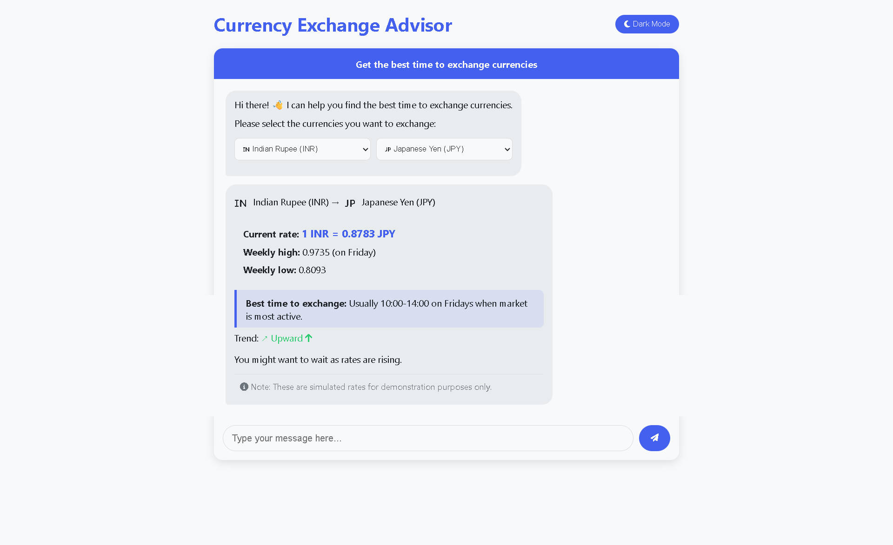
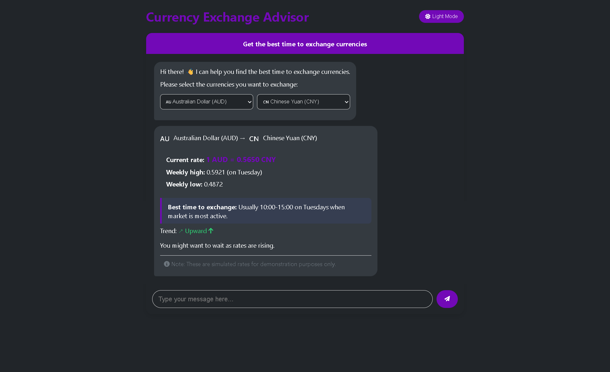

# 💱 Currency Exchange Advisor

A sleek chatbot-style web application that helps users determine the **best time to exchange currencies**. It features a beautiful UI, light/dark mode toggle, currency selection with flags, and simulated exchange rate suggestions.

---

## 🚀 Features

- 🌍 Select source and target currencies
- 💬 Chat-style interface with auto-replies
- 🌗 Light and dark theme toggle
- 📈 Shows exchange rate trends (mocked)
- 🧠 Suggests best time to exchange
- ⚙️ Built with HTML, CSS, and Vanilla JS (no frameworks)

---

## 📸 Screenshots

### 🟢 1. Initial Interface

Shows welcome message and dropdowns for selecting currencies.

---

### 🔁 2. Working Chat Interface

User submits a currency exchange query and receives simulated advice.

---

### 🌙 3. Dark Mode View

Dark theme applied to the working chatbot interface.

---

## 🛠️ How to Run Locally

1. Clone or download this repo  
2. Open `index.html` in your browser  
3. Select currencies, type a message, and observe the response  
4. Use the theme toggle for light/dark experience  

> 💡 Note: This app **does not use real APIs**. All data is simulated for demonstration purposes only.

---

## 📁 Folder Structure
Currency-Exchange-Advisor/
├── index.html
├── README.md
├── screenshot1_start.png
├── screenshot2_working.png
└── screenshot3_darkmode.png

---

## 🧠 Tech Stack

- HTML5
- CSS3
- JavaScript (Vanilla)
- Font Awesome for icons

---

## 📝 Disclaimer

> ⚠️ This is a demo project. Currency exchange rates and timing suggestions are randomly generated and should **not** be used for actual financial decisions.

